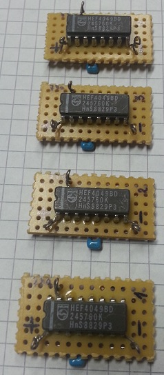
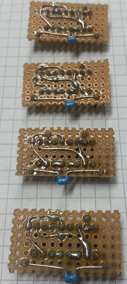
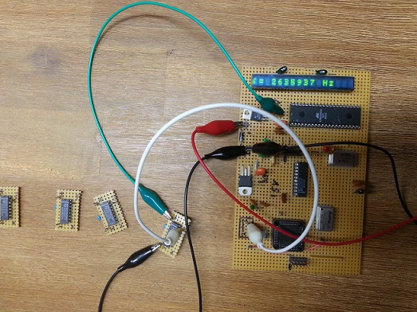
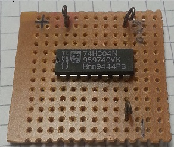

# ring-oscillator
A collection of self-made ring oscillator subcircuits.

# Ring oscillators with CMOS 4049

Oscillator | Frequency (MHz)
---|-------------
1 | 2.632
2 | 2.481
3 | 2.56
4 | 2.144

## Schematics
TODO

## Top of the boards

## Bottom of the boards

## Example of frequency measurement

# Ring oscillator with 74HC04

Oscillator | Frequency (MHz)
---|-------------
1 | 26.275

## Schematics
TODO

## Top of the board

## Bottom of the board

