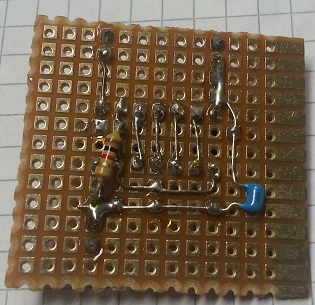

# ring-oscillator
A collection of self-made ring oscillator subcircuits.

# Ring oscillators with CMOS 4049

The oscillation is very unstable and varies up to 100 kHz.
Here is an average oscillation frequency:

Oscillator | Frequency (MHz)
---|-------------
1 | 2.632
2 | 2.481
3 | 2.56
4 | 2.144

## Schematics
TODO

## Top of the boards

## Bottom of the boards

## Example of frequency measurement
The frequency has been measured using my [frequency counter](https://github.com/aelfimow/frequency-counter-1).

# Ring oscillator with 74HC04

Oscillator | Frequency (MHz)
---|-------------
1 | 26.275

## Schematics
TODO

## Top of the board

## Bottom of the board

